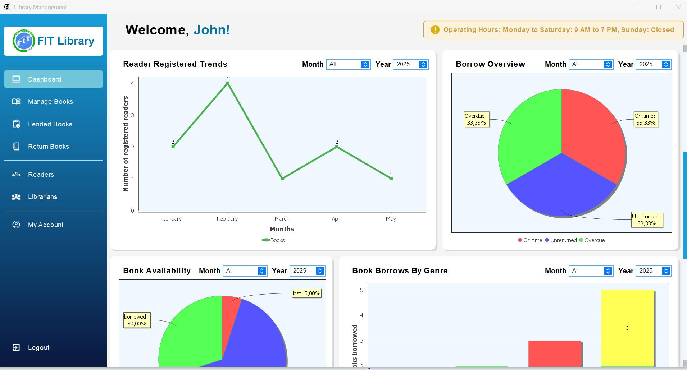
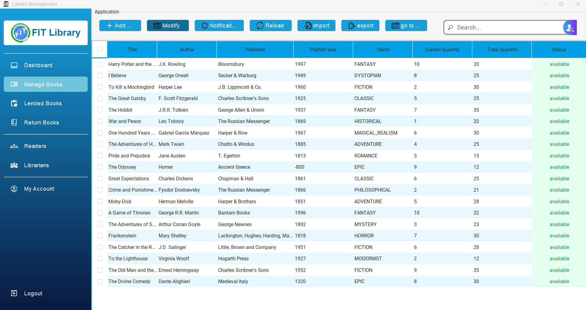
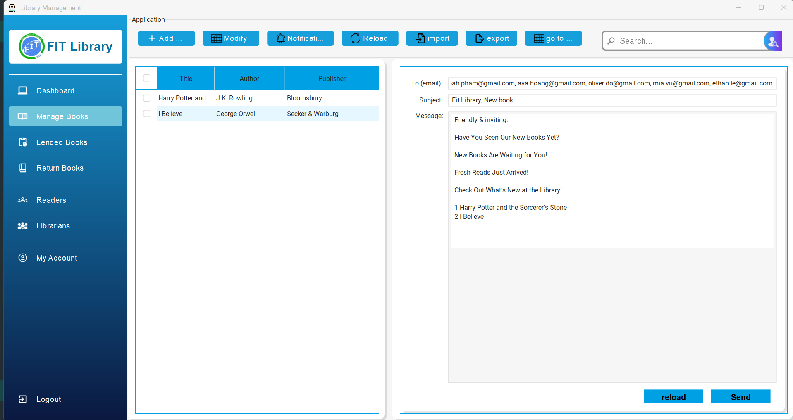
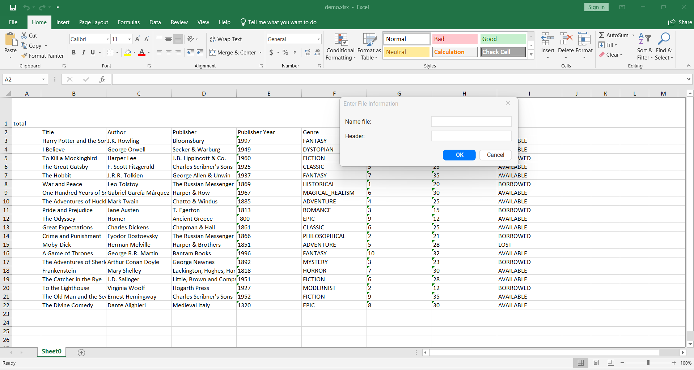
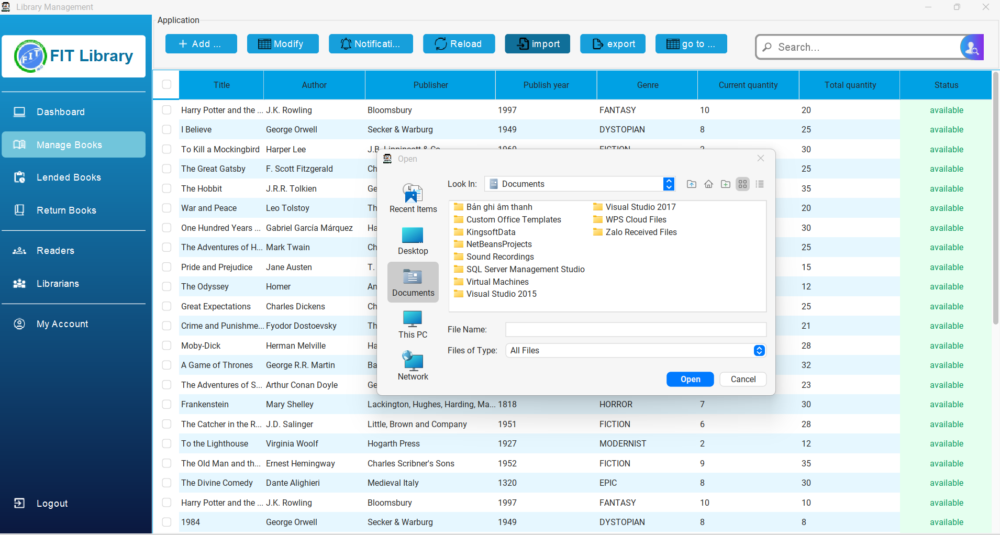
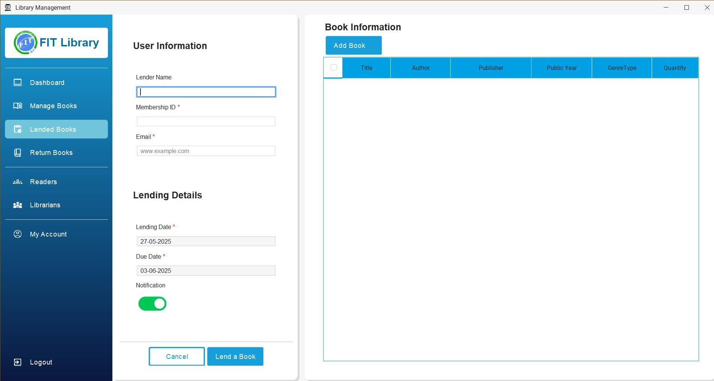
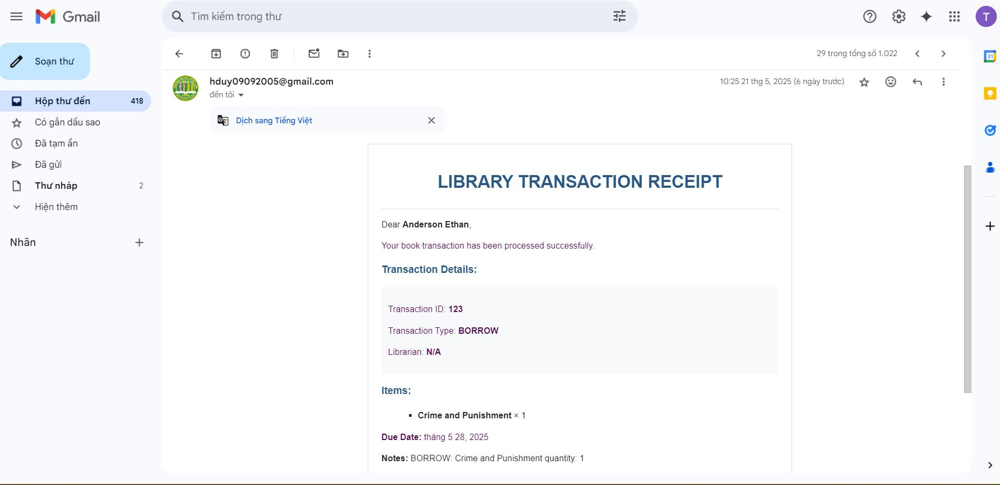
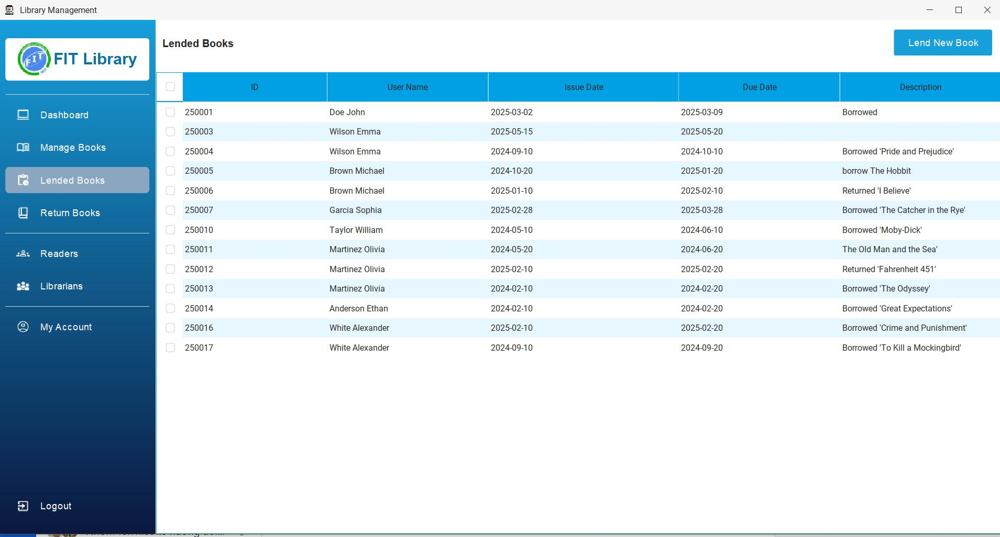
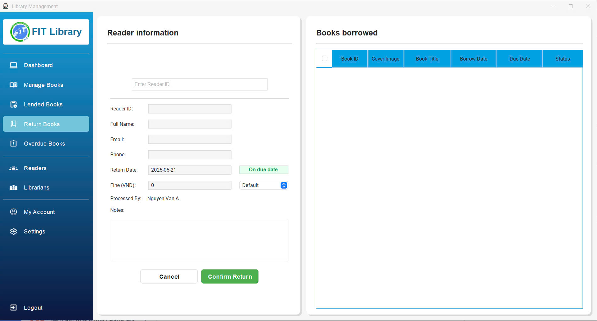
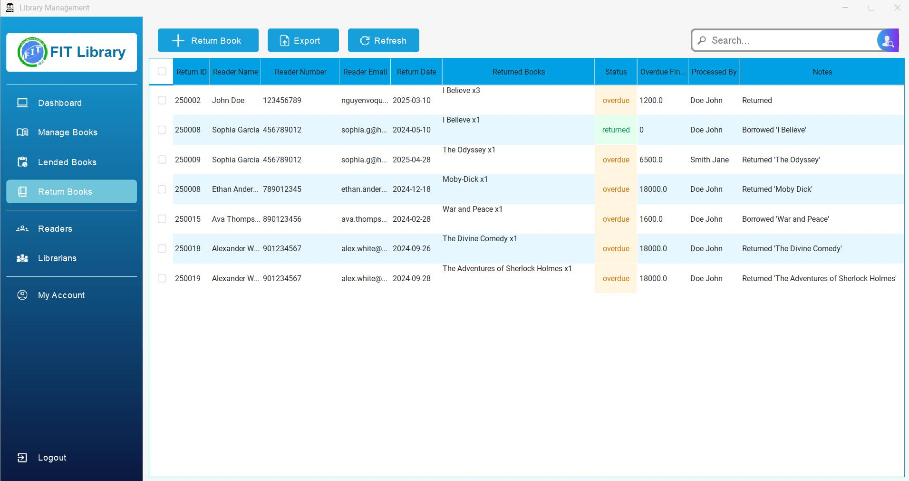

# 📚 Library Management System

The Library Management System manages books, users, and borrowing/returning processes with an intuitive interface for librarians and readers.

## 🔑 Key Features

- **Book Management**: Add, edit, delete, and search for books; track inventory and availability
- **User Administration**: Manage different user roles, profiles, and access control
- **Transaction Processing**: Handle borrowing/returning workflows, due dates, and notifications
- **Reporting & Analytics**: Track statistics, overdue items, and usage patterns

## 🎯 Design Patterns

- **Observer Pattern**: Notification system for overdue books and new arrivals; maintains loose coupling
- **Strategy Pattern**: Fee calculation algorithms for different reader types
- **MVC Pattern**: Separation of business logic, data, and presentation layers
- **Facade Pattern**: Simplified interface to complex library subsystems
- **Singleton Pattern**: Single instances of critical components with global access points

## 🛠️ Technology Stack

- **Backend**: Java Core + Spring framework
- **Frontend**: Swing
- **Messaging**: RabbitMQ for notifications
## 🐰 RabbitMQ workflow


## 👨‍💻 Development Team

| No. | Full Name                  | Student ID |
|-----|----------------------------|------------|
| 01  | Nguyễn Hữu Duy             | 23130075   |
| 02  | Lê Ngọc Châu               | 23130028   |
| 03  | Phan Bá Huy Hoàng          | 23130117   |
| 04  | Nguyễn Võ Quốc Tuấn        | 23130370   |
| 05  | Trần Bảo Khang             | 23130147   |
| 06  | Nguyễn Minh Trí            | 23130345   |

## 🚀 Getting Started

### Prerequisites
- JDK 11 or higher
- Maven 3.6+

### Installation

1. Clone the repository:
   ```bash
   git clone https://github.com/yourusername/library-management.git
   ```

2. Navigate to the project directory and build:
   ```bash
   cd library-system && mvn clean install
   ```

3. Run the application:
   ```bash
   mvn spring-boot:run
   ```

## Application Screenshots

### Dashboard

- **Dashboard Charts**
  
### Book Management
###### 1. Table show data

###### 2. Notification new book

###### 3. Export excel

###### 4. Import excel

### Borrowed Books

- **Borrow Book Transaction Email**
   
- **Borrow Book Table**
    
### Return Processing

- **Return Book Table**
  

### Administrator Workflow
1. **Admin Login** - Access the system with administrator credentials
2. **Dashboard** - View system statistics and analytics
3. **Book Management**
    - Add, edit, and delete books in the collection
    - Update inventory and track availability
4. **Lending Process**
    - Process book checkout requests
    - Record borrower information
    - Set due dates
5. **Return Processing**
    - Record returned books
    - Calculate and process late fees if applicable
    - Update book availability status
6. **User Administration**
    - Manage user accounts and permissions
    - View borrowing history

## License

This project is licensed under the MIT License - see the LICENSE file for details.

