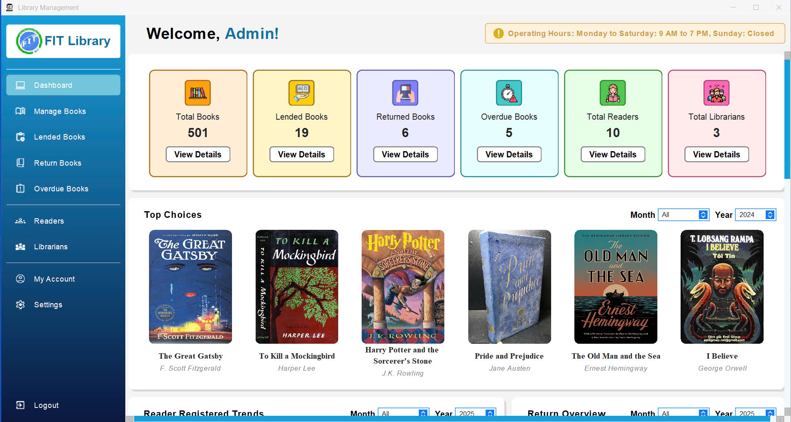

# 📚 Library Management System

The **Library Management System** project is designed to efficiently and conveniently manage books, users, and the borrowing-returning process.

## 👨‍💻 Team Members

| No. | Full Name                  | Student ID |
|-----|----------------------------|------------|
| 01  | Nguyễn Hữu Duy             | 23130075   |
| 02  | Lê Ngọc Châu               | 23130028   |
| 03  | Phan Bá Huy Hoàng          | 23130117   |
| 04  | Nguyễn Võ Quốc Tuấn        | 23130370   |
| 05  | Trần Bảo Khang             | 23130147   |
| 06  | Nguyễn Minh Trí            | 23130345   |

## 🎯 Project Objectives

- Manage book information, genres, and authors.
- Manage users (librarians and readers).
- Handle book borrowing and returning processes.
- Track overdue books.
- Provide a user-friendly interface.

## 🛠️ Technologies Used

- **Language**: Java

## 🔑 Key Features

- 📖 Book Management (Add, Edit, Delete, Search).
- 👤 User Management (Librarian & Reader roles).
- 📝 Borrowing & Returning Books.
- 📊 Statistics (Borrowed books, Overdue books).
- 🔐 Login / Logout System.

## 🚀 How to Run the Project

1. Clone the repository:
   ```bash
   git clone https://github.com/yourusername/library-management.git
   ```

## 📽️ App Demo

### 📸 Screenshots
Below are some example screenshots showcasing the app's interface and features:




### 🎬 Video Demo
Watch the application demo video here: [Library Management System Demo](#)

### 📝 Illustrated Features
1. **Login Interface**: Login as either a Librarian or a Reader.
2. **Book Management**: Add, edit, delete, and search for books effortlessly.
3. **Borrowing & Returning Books**: A simple and clear borrowing/returning process.
4. **Statistics**: View borrowed books and overdue books lists.